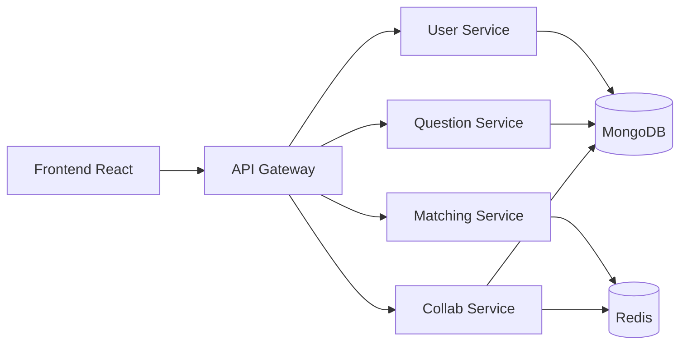

# PeerPrep G08 - Análise e Refatoração da Qualidade de Software

Versão acadêmica do PeerPrep preparada para a atividade de Teste e Qualidade de Software do curso de Análise e Desenvolvimento de Sistemas do IFCE - Campus Tauá.

## Integrantes

- Guilherme Alves dos Santos
- Paulo Cosmo da Silva Clarentino

## Repositórios

- Projeto original: https://github.com/CS3219-AY2526S2/peerprep-g08
- Versão refatorada: https://github.com/guilhermealves05/peerprep-g08-trabalho
- Commit final analisado: `bc52f10407b6f58a1a59dd6d1f57f0aa7fd18de0`
- Licença do projeto original: MIT

## Sobre o projeto

PeerPrep é uma plataforma para prática colaborativa de entrevistas técnicas. O sistema permite cadastrar usuários, consultar questões, procurar um parceiro por linguagem e tópico e trabalhar em uma sala com editor de código, presença e sincronização em tempo real.

O projeto adota uma arquitetura de microsserviços. O frontend acessa um API Gateway, que encaminha requisições para os serviços de usuários, perguntas, matching e colaboração.



## Tecnologias principais

| Camada | Tecnologias |
|---|---|
| Frontend | React 19, TypeScript 5.9, Vite 7, HeroUI, Monaco Editor, React Query |
| Comunicação em tempo real | Socket.IO, Yjs, y-websocket e y-monaco |
| Backend | Node.js, Express e API Gateway com proxy HTTP/WebSocket |
| Persistência | MongoDB/Mongoose e Redis |
| Testes | Jest, Supertest e mongodb-memory-server |
| Infraestrutura | Docker e Docker Compose |

## Ferramentas de qualidade

| Ferramenta | Uso no trabalho |
|---|---|
| SonarCloud / SonarJS | Complexidade ciclomática e cognitiva, code smells, bugs, vulnerabilidades, violações, duplicação e linhas de código |
| ESLint | Regras JavaScript, TypeScript e React Hooks; verificação direcionada dos arquivos alterados |
| SonarLint | Diagnóstico local de complexidade e code smells durante a refatoração |
| jscpd | Verificação complementar de clones nos componentes de matching e colaboração |
| Jest / Supertest | Testes de regressão dos serviços |
| TypeScript / Vite | Verificação de tipos e build do frontend |
| Git / GitHub | Rastreabilidade das alterações, autoria, branches, Pull Requests e merges |
| ChatGPT/Codex | Apoio à análise de alternativas, revisão e documentação; decisões e validações realizadas pela dupla |

## Escopo da refatoração

Foram priorizados cinco módulos críticos:

1. `user-service/controller/user-controller.js`
2. `question-service/controllers/questionController.js`
3. `frontend/src/features/collab/hooks/useYjs.ts` e `Room.tsx`
4. `frontend/src/features/matching/pages/MatchingPage.tsx`
5. `frontend/src/features/collab/components/CollabEditor.tsx`

Principais mudanças:

- Centralização de validações e buscas repetidas no controlador de usuários.
- Separação das etapas de cadastro, código administrativo e confirmação por OTP.
- Reuso da proteção que impede rebaixar ou excluir o último administrador.
- Tratamento literal de metacaracteres em filtros de perguntas e remoção de regex dinâmica na categoria.
- Validação centralizada dos campos obrigatórios de perguntas.
- Sessão Yjs criada de forma estável, URL configurável e cleanup explícito.
- Socket do matching mantido em `useRef` e regras de validação representadas de forma declarativa.
- Processamento dos cursores colaborativos extraído, tipado e simplificado com `flatMap`.
- Handlers nomeados e remoção explícita de listeners durante o descarte.

## Resultado antes e depois

Medição global realizada no SonarCloud com o mesmo conjunto de fontes e exclusões.

| Categoria | Indicador | Antes | Depois | Variação |
|---|---|---:|---:|---:|
| Manutenibilidade | Complexidade ciclomática | 959 | 940 | -19 (-2,0%) |
| Manutenibilidade | Complexidade cognitiva | 635 | 561 | -74 (-11,7%) |
| Manutenibilidade | Code smells | 87 | 71 | -16 (-18,4%) |
| Conformidade | Violações | 133 | 114 | -19 (-14,3%) |
| Segurança | Vulnerabilidades | 42 | 39 | -3 (-7,1%) |
| Confiabilidade | Bugs | 4 | 4 | sem alteração |
| Duplicação | Linhas duplicadas | 6 | 0 | -6 |
| Duplicação | Densidade duplicada | 0,0% | 0,0% | estável por arredondamento |
| Tamanho | Linhas de código (`ncloc`) | 6.506 | 6.602 | +96 (+1,5%) |

O aumento de linhas não foi tratado como piora automática: foram incluídos tipos, funções auxiliares, handlers nomeados, guardas, cleanup e testes. Ao mesmo tempo, os quatro bugs globais permaneceram e são registrados como débito técnico, sem alegação de correção fora do escopo.

## Validação

| Componente | Resultado registrado |
|---|---:|
| Question Service | 10 testes aprovados |
| User Service | 7 suítes e 109 testes aprovados |
| Matching Service | 40 testes aprovados |
| Collab Service | 83 testes aprovados |
| Total | 242 testes aprovados |
| Frontend | build concluído; 3.107 módulos processados |
| SonarCloud | análise final concluída com sucesso |

## Como executar com Docker

Pré-requisitos: Docker e Docker Compose instalados.

Na raiz do repositório, crie os arquivos de ambiente a partir dos exemplos e preencha os valores necessários:

```bash
cp user-service/.env.example user-service/.env
cp matching-service/.env.example matching-service/.env
cp question-service/.env.example question-service/.env
cp collab-service/.env.example collab-service/.env
```

Suba a aplicação:

```bash
docker compose up --build -d
```

Acesse:

```text
http://localhost:5173
```

Para acompanhar os serviços:

```bash
docker compose ps
docker compose logs -f
```

Para encerrar:

```bash
docker compose down
```

## Como executar os testes

Instale as dependências de cada serviço antes da primeira execução.

```bash
cd question-service && npm install && npm test -- --runInBand
cd ../user-service && npm install && npm test
cd ../matching-service && npm install && npm test
cd ../collab-service && npm install && npm test
cd ../frontend && npm install && npm run build
```

## Observações sobre as métricas

- Os valores do SonarCloud são globais e não devem ser somados às medições locais por arquivo.
- A densidade de duplicação apareceu como `0,0%` antes e depois, embora as linhas duplicadas tenham caído de 6 para 0; a diferença ocorre por arredondamento.
- O jscpd foi usado como evidência complementar com escopo e limiar próprios. Seus resultados não substituem a medição global do SonarCloud.
- Testes aprovados reduzem o risco de regressão, mas não provam ausência absoluta de defeitos.

## Licença

O projeto original é distribuído sob a licença MIT. Consulte o arquivo [LICENSE](LICENSE).
